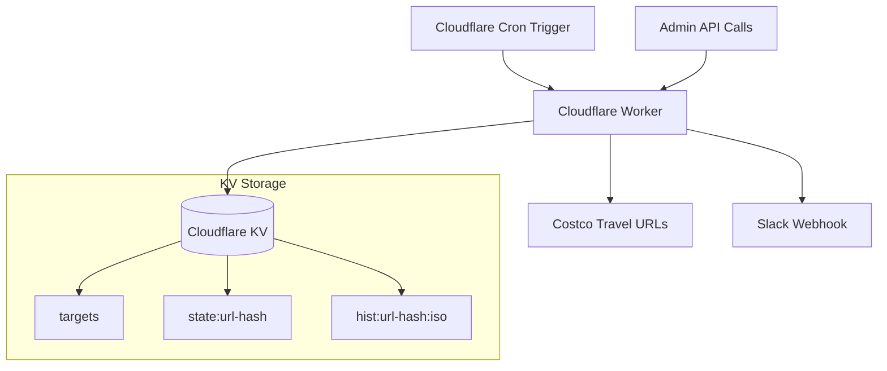

# Design Document

## Overview

The Costco Travel Deal Watcher is a serverless application built on Cloudflare Workers that monitors promotional changes on Costco Travel pages and sends Slack notifications when material changes are detected. The system uses Cloudflare's edge computing platform for low-latency execution, KV storage for state management, and Cron Triggers for automated scheduling.

The architecture prioritizes cost efficiency (operating within free tier limits), reliability (graceful error handling), and maintainability (single-file implementation under 300 LOC).

## Architecture

### High-Level Architecture



### Request Flow

1. **Scheduled Execution**: Cron trigger invokes the worker every 3 hours
2. **Target Retrieval**: Worker fetches target URLs from KV storage
3. **Content Scraping**: Worker fetches and parses each target URL
4. **Change Detection**: Worker compares current content with stored state
5. **Notification**: Worker sends Slack notifications for material changes
6. **State Update**: Worker updates KV storage with new state and history

### Manual Execution Flow

1. **API Request**: Admin calls `/admin/run` with authentication token
2. **Immediate Processing**: Worker executes the same monitoring logic
3. **Response**: Worker returns execution results

## Components and Interfaces

### Core Components

#### 1. Request Handler (`handleRequest`)
- **Purpose**: Routes incoming HTTP requests to appropriate handlers
- **Inputs**: Request object, environment variables
- **Outputs**: Response object
- **Routes**:
  - `POST /admin/targets` - Manage target URLs
  - `GET /admin/targets` - Retrieve target URLs  
  - `POST /admin/run` - Trigger manual execution
  - `GET /healthz` - Health check endpoint

#### 2. Cron Handler (`handleCron`)
- **Purpose**: Processes scheduled monitoring runs
- **Inputs**: Cron event, environment variables
- **Outputs**: Execution results
- **Flow**:
  1. Retrieve targets from KV
  2. Process each enabled target
  3. Update state and history
  4. Send notifications for changes

#### 3. Content Processor (`processTarget`)
- **Purpose**: Scrapes and analyzes a single target URL
- **Inputs**: Target configuration, previous state
- **Outputs**: Current promotions, change detection results
- **Steps**:
  1. Fetch HTML content with proper User-Agent
  2. Extract promotional content using CSS selectors
  3. Normalize and parse promotion data
  4. Compare with previous state
  5. Identify material changes

#### 4. Promotion Parser (`parsePromotions`)
- **Purpose**: Extracts structured promotion data from HTML
- **Inputs**: HTML content, CSS selector
- **Outputs**: Array of promotion objects
- **Logic**:
  - Use HTMLRewriter for efficient DOM parsing
  - Extract promotion details (title, perk, dates, price)
  - Generate stable IDs using content hashing
  - Normalize text (collapse whitespace, remove timestamps)

#### 5. Change Detector (`detectChanges`)
- **Purpose**: Identifies material differences between promotion sets
- **Inputs**: Current promotions, previous promotions
- **Outputs**: Change summary (added, removed, changed)
- **Algorithm**:
  - Compare promotion IDs to find additions/removals
  - Compare promotion content for existing IDs
  - Filter out cosmetic changes using noise patterns

#### 6. Notification Service (`sendSlackNotification`)
- **Purpose**: Sends formatted notifications to Slack
- **Inputs**: Target info, change summary
- **Outputs**: Slack webhook response
- **Format**: Rich blocks with promotion details and metadata

### Data Interfaces

#### Target Configuration
```typescript
interface Target {
  url: string;           // Costco Travel URL to monitor
  selector: string;      // CSS selector for promotion container
  name?: string;         // Human-readable name
  notes?: string;        // Additional context
  enabled?: boolean;     // Whether to process this target
}
```

#### Promotion Object
```typescript
interface Promotion {
  id: string;           // Stable hash of content
  title: string;        // Promotion title
  perk: string;         // Benefit description
  dates: string;        // Valid date range
  price: string;        // Price information
}
```

#### State Object
```typescript
interface TargetState {
  hash: string;         // Hash of current promotions
  promos: Promotion[];  // Current promotion list
  lastSeenISO: string;  // Last update timestamp
}
```

## Data Models

### KV Storage Schema

#### 1. Targets Configuration (`targets`)
- **Key**: `"targets"`
- **Value**: `Target[]` - JSON array of target configurations
- **Usage**: Read on every cron run, updated via admin API

#### 2. Target State (`state:<url-hash>`)
- **Key**: `"state:" + sha256(target.url)`
- **Value**: `TargetState` - Current state for comparison
- **Usage**: Read/write on every target processing

#### 3. Historical Snapshots (`hist:<url-hash>:<iso>`)
- **Key**: `"hist:" + sha256(target.url) + ":" + isoTimestamp`
- **Value**: `{ promos: Promotion[], hash: string }` - Point-in-time snapshot
- **Usage**: Written on material changes, pruned to last 5 entries

### URL Hashing Strategy
- Use SHA-256 hash of target URL for consistent key generation
- Truncate to first 16 characters for readability
- Ensures stable keys across deployments

## Error Handling

### Network Failures
- **HTTP Errors**: Log error, skip target, continue processing others
- **Timeouts**: Set 30-second timeout, handle gracefully
- **DNS Failures**: Log and skip, don't crash entire run

### Parsing Failures
- **Invalid HTML**: Log warning, skip target
- **Missing Selectors**: Log error, skip target
- **Malformed Content**: Use fallback parsing, log issues

### KV Operation Failures
- **Read Failures**: Use empty state as fallback
- **Write Failures**: Retry with exponential backoff (3 attempts)
- **Quota Exceeded**: Log error, continue with read-only operations

### Slack Notification Failures
- **Webhook Errors**: Log error, don't retry (avoid spam)
- **Rate Limiting**: Implement basic backoff
- **Invalid Payloads**: Validate before sending

## Testing Strategy

### Unit Testing
- **Promotion Parser**: Test with sanitized HTML fixtures
- **Change Detector**: Test with various promotion combinations
- **Text Normalizer**: Test noise filtering patterns
- **Hash Generator**: Verify stability and uniqueness

### Integration Testing
- **KV Operations**: Test read/write cycles with mock data
- **HTTP Requests**: Test with mock Costco Travel responses
- **Slack Integration**: Test with webhook validation endpoint

### End-to-End Testing
- **Dry Run Mode**: Process targets without sending notifications
- **Manual Triggers**: Test admin endpoints with authentication
- **Cron Simulation**: Test scheduled execution flow

### Performance Testing
- **CPU Usage**: Verify <50ms execution time
- **Memory Usage**: Monitor within Worker limits
- **KV Operations**: Optimize for minimal read/write operations

## Security Considerations

### Authentication
- **Admin Token**: Secure random token stored as environment variable
- **Token Validation**: Compare using constant-time comparison
- **Endpoint Protection**: All admin endpoints require valid token

### Data Privacy
- **No PII Storage**: Only store promotional content and metadata
- **Minimal Logging**: Log errors without sensitive data
- **Secure Transmission**: All external requests use HTTPS

### Rate Limiting
- **Costco Requests**: Respect robots.txt and reasonable intervals
- **Slack Notifications**: Avoid spam with change detection
- **Admin API**: Basic rate limiting on sensitive endpoints

## Deployment Configuration

### Environment Variables
- `ADMIN_TOKEN`: Secret token for admin API access
- `SLACK_WEBHOOK`: Slack incoming webhook URL

### KV Namespace
- `DEAL_WATCHER`: Primary namespace for all data storage

### Cron Schedule
- `"0 */3 * * *"`: Every 3 hours (configurable via dashboard)

### Worker Configuration
- **Compatibility Date**: 2025-08-08
- **Module Format**: ES2022 service worker
- **CPU Limit**: 50ms typical execution
- **Memory Limit**: Within standard Worker limits